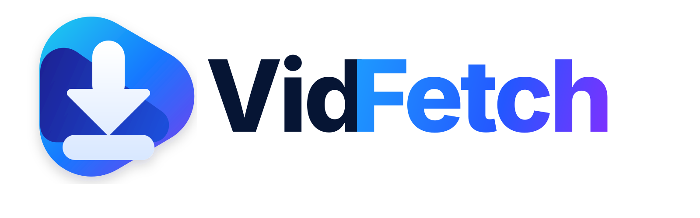

<div align="center">



# VidFetch

**A simple, open-source Windows desktop downloader powered by yt-dlp and FFmpeg.**

Paste a media URL, choose the quality and format you want, and download it without having to learn command-line options.

[](https://github.com/ElOrlyman/VidFetch)
[](https://www.python.org/)
[](https://github.com/yt-dlp/yt-dlp)
[](LICENSE)

</div>

---

## What is VidFetch?

VidFetch is a lightweight graphical interface for [yt-dlp](https://github.com/yt-dlp/yt-dlp).

It is intended for people who want the flexibility of yt-dlp without having to remember format selectors, post-processing flags, FFmpeg commands, or terminal syntax.

The basic workflow is intentionally simple:

1. Paste a supported media URL.
2. Click **Analyze**.
3. Choose a resolution or audio format.
4. Adjust any optional settings.
5. Click **Download**.

VidFetch uses yt-dlp for extraction and downloading, and FFmpeg for operations such as combining separate video/audio streams, remuxing containers, extracting audio, and embedding media information.

## Features

- Paste and analyze supported media URLs
- Detect the resolutions available for a video
- Download the best available quality automatically
- Select a maximum resolution such as 2160p, 1440p, 1080p, or 720p
- Download video with audio
- Video containers:
  - MP4
  - MKV
  - WebM
- Audio-only downloads:
  - MP3
  - M4A
  - Opus
  - FLAC
  - WAV
- Configurable audio quality
- Optional frame-rate limit
- Optional download speed limit
- Configurable concurrent fragment downloads
- Playlist support toggle
- Embed metadata
- Embed thumbnails
- Download and embed subtitles
- Live progress percentage
- Transfer speed and ETA
- Cancel an active download
- Choose the destination folder
- Portable dependency lookup
- Native Windows `.exe` builds with PyInstaller
- Automated Windows builds with GitHub Actions

## Supported websites

VidFetch relies on yt-dlp for site support, so it can work with many websites supported by yt-dlp rather than being tied to a single service.

Extractor support changes over time as websites change. For the current compatibility list, see the [yt-dlp supported sites documentation](https://github.com/yt-dlp/yt-dlp/blob/master/supportedsites.md).

> Some websites may require authentication, cookies, JavaScript challenge handling, or other site-specific configuration that VidFetch does not currently expose through the GUI.

## Download VidFetch

### Prebuilt Windows application

Windows builds are produced by the GitHub Actions workflow in this repository.

Until packaged releases are published, developers and testers can build VidFetch locally using the instructions below.

A future stable release will provide a ready-to-run `VidFetch.exe` through the repository's **Releases** page.

### Run from source

Requirements:

- Windows 10 or Windows 11
- Python 3.11+
- FFmpeg / FFprobe
- Deno is recommended for current yt-dlp JavaScript challenge support

Clone the repository:

```powershell
git clone https://github.com/ElOrlyman/VidFetch.git
cd VidFetch
```

Install the Python dependency:

```powershell
py -m pip install -r requirements.txt
```

Run VidFetch:

```powershell
py vidfetch.py
```

## Install external dependencies on Windows

### FFmpeg

FFmpeg is required for combining high-quality video and audio streams and for media post-processing.

Using WinGet:

```powershell
winget install Gyan.FFmpeg
```

Verify the installation:

```powershell
ffmpeg -version
ffprobe -version
```

### Deno

Modern yt-dlp versions can use an external JavaScript runtime for challenge solving. Deno is the recommended option.

Using WinGet:

```powershell
winget install DenoLand.Deno
```

Verify:

```powershell
deno --version
```

## Portable mode

VidFetch checks its own application directory before checking the Windows `PATH` environment variable for external tools.

This means a portable folder can be structured like this:

```text
VidFetch/
├── VidFetch.exe
├── ffmpeg.exe
├── ffprobe.exe
└── deno.exe
```

This makes it possible to run VidFetch without installing FFmpeg or Deno globally.

> FFmpeg and Deno are separate projects and are not redistributed by this repository. Review their licenses before redistributing their binaries with VidFetch.

## Build the Windows executable

Install development dependencies:

```powershell
py -m pip install -r requirements-dev.txt
```

Then run:

```powershell
.\build.ps1
```

The executable will be created at:

```text
dist\VidFetch.exe
```

## GitHub Actions

The workflow at `.github/workflows/build-windows.yml` automatically builds the Windows executable.

It currently runs for:

- Pushes to `main`
- Pull requests
- Version tags
- Manual workflow runs

The resulting executable is uploaded as a workflow artifact.

## Example configurations

### 1080p MP4

```text
Mode: Video + Audio
Resolution: 1080p
Container: MP4
Parallel fragments: 4
```

### Best available quality

```text
Mode: Video + Audio
Resolution: Best
Container: MKV
```

MKV can be useful when the best available video and audio codecs do not fit cleanly into an MP4 container.

### MP3 audio

```text
Mode: Audio only
Audio format: MP3
Audio quality: 320K
```

### Limit download bandwidth

The speed-limit field accepts yt-dlp rate values such as:

```text
500K
2M
10M
```

Leave it empty for no application-level rate limit.

## Why VidFetch?

`yt-dlp` is extremely capable, but its flexibility also means that common operations can involve long commands and format-selection syntax.

VidFetch is not trying to replace yt-dlp. It provides a small desktop UI on top of it for the tasks most people perform repeatedly.

Advanced users can still use yt-dlp directly whenever they need options that VidFetch does not expose yet.

## Roadmap

Potential improvements include:

- Polished Windows 11-style interface
- Dark mode
- Video thumbnail preview
- Estimated file size before downloading
- Download queue
- Download history
- Open-folder button after completion
- Clipboard URL detection
- Per-format codec information
- Cookie/browser authentication options
- Proxy configuration
- Automatic dependency detection and setup help
- Application auto-update support
- Signed release builds
- Installer and portable ZIP releases

Ideas and pull requests are welcome.

## Contributing

Contributions are welcome. See [CONTRIBUTING.md](CONTRIBUTING.md) for the development workflow and contribution guidelines.

If you find a bug or have an idea for a feature, open an issue with enough information to reproduce or understand the request.

## Legal and responsible use

VidFetch is a general-purpose interface for yt-dlp.

Use it only to download media that you own, media that is in the public domain, or content that you otherwise have permission or a legal right to download.

You are responsible for complying with applicable copyright law, licensing terms, and the terms of service of the website from which you obtain media.

VidFetch does not provide or host media and is not affiliated with YouTube, Google, yt-dlp, FFmpeg, Deno, or any supported website.

## Third-party projects

VidFetch is built around excellent open-source tools:

- [yt-dlp](https://github.com/yt-dlp/yt-dlp) — media extraction and downloading
- [FFmpeg](https://ffmpeg.org/) — media processing
- [Deno](https://deno.com/) — optional JavaScript runtime used by yt-dlp
- [PyInstaller](https://pyinstaller.org/) — Windows executable packaging

Please support those projects and review their documentation and licenses when redistributing their software.

## License

VidFetch is released under the [MIT License](LICENSE).

---

<div align="center">

**VidFetch — paste, choose, download.**

</div>
